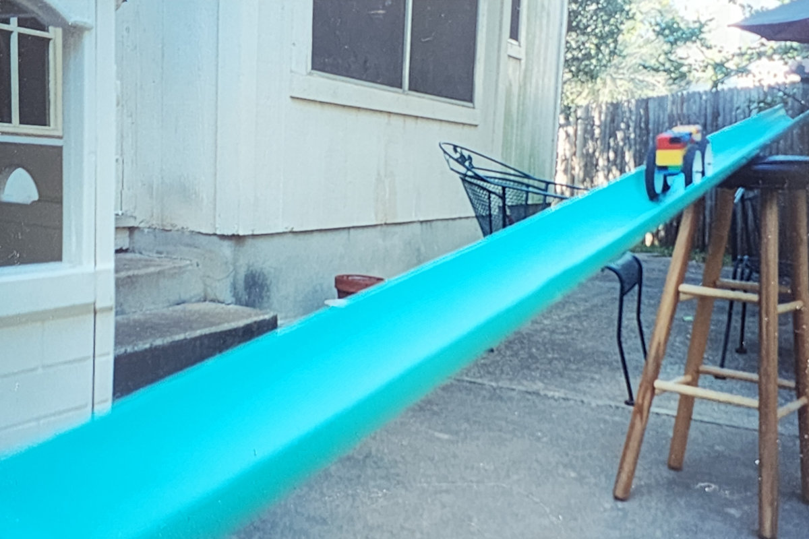
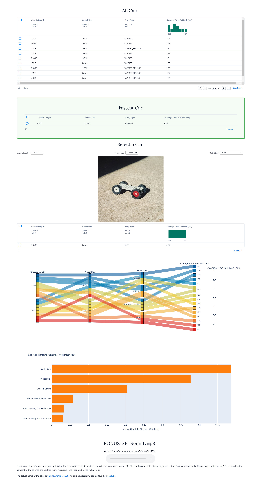

# Science Project - Fifth Grade



My science project from fifth grade (2004), revamped for modern data science 20 years later (2024).

I found this project while digging around an old bankers box. I transcribed the data and set up a modern data science-y exploration as a single [Marimo](https://marimo.io/) notebook. There are only a handful of examples, but it's fun to poke around a dataset I personally harvested as a kid at a time when I knew almost nothing about math, science, engineering, and software.

## Usage

### Deployed web app

[](https://falling-wave-8700.ploomberapp.io/)

### Local app

#### Setup

Create and activate a [`venv`](https://docs.python.org/3/library/venv.html). Then run

```sh
pip install -r requirements.txt
```

#### Run

Run

```sh
marimo run science.py
```

## Preview



## Experiment Reproduction

*These are the experiment instructions reproduced ~verbatim from my original submission in fifth grade.*

### Materials

To perform this experiment you will need:

- Legos that can be made into multiple car designs.
- A 13 ft. piece of sewer pipe.
- A chair to prop the pipe on.
- A stopwatch to take time measurements.

### Step-By-Step Instructions

1. First gather up some Legos and make sure you have:

    - 2 different wheel sizes
    - 2 different flat pieces for the chassis lengths
    - 10 slanted pieces and 60 regular 2*4 bricks for the bodies

2. Make a data table including these variables:
    1. Long Chassis
    2. Short Chassis
    3. Large Wheels
    4. Medium Wheels
    5. Slanted Body with 20*4 base; 11 bricks tall
    6. Same as 5., but run backward (aerodynamics test)
    7. Brick Body with 20*4 base; 5 bricks tall
    8. No extra parts; bare chassis

3. Get a piece of pipe 10-15 ft. long and cut it in half with a saber saw or by other means. Do this so you can see the car to know when to stop your stopwatch, and to double the length.

4. Lay one of the halves about 4-8 inches over the other.

5. Prop the pipe on something like a stool that is about 3 ½ feet tall, and another object 1 ½ feet tall.

6. Try to get the pipes so the bump where the first pipe half ends is small.

7. Now test each combination 7 times and average them, to get more accurate results, and record the data on the data table.

8. Compare the results and find the differences.  

## Bibliography

*This is the bibliography reproduced ~verbatim from my original submission in fifth grade.*

### Websites

[WiseGeek - What are Car Aerodynamics?](https://web.archive.org/web/20051222142511/http://www.wisegeek.com/what-are-car-aerodynamics.htm) for information on how a slanted front and straight front can make a difference in speed.

### Family

My grandpa Larry for help with wheel to axle ratio.
My dad for help with cutting the pipe, help with making the graph, letting the cars go on the track, and letting me borrow his watch.

### Businesses

The Legoland in the Mall of America, Minnesota for free usage of pieces where I learned that weight makes a speed difference.
